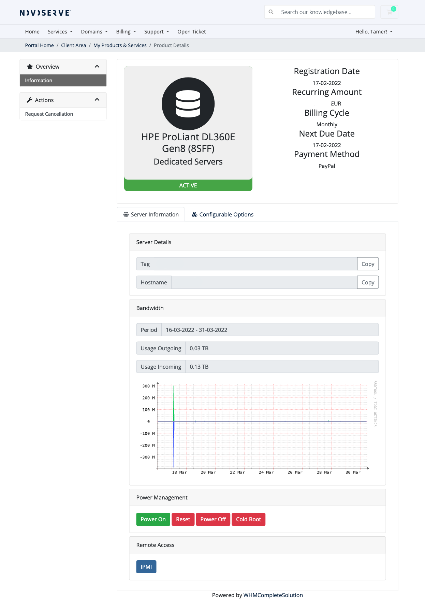

# NovoServe WHMCS Module

### Introduction

This provisioning module allows you as a reseller to offer your customers full server management.
With just one click they are able to login to the IPMI of the server (e.g. HPE iLO). This feature is also available as an administrator.

Features:
- Autologin IPMI for the clientarea;
- Autologin IPMI for the admin side;
- Whitelabel console URL generation;
- Server power management;
- Bandwidth usage graph;
- Traffic usage for current period.

### Screenshot

### Requirements
- WHMCS 7.x or 8.x;
- PHP 7 and the cURL extension;
- NovoServe API credentials (you can generate them in the NovoServe portal, under API Management).

### Installation

1. Upload the contents of the ZIP into your WHMCS root directory.
2. Setup a new or use an existing Product as "Server/VPS":
3. Under Module Settings, select the "NovoServe Module".
4. Now enter your API credentials accordingly and decide if you want whitelabel consoles (without any logo), or the default NovoServe branded. If you want to use the whitelabel console then enter "yes" in the textbox. For resellers with the branded console can also use their ID here.
5. Go to a service that uses this (newly) product and ensure that the Username contains a server tag (000-000). This is a requirement.

Note: Ensure that you added the IP address of your WHMCS instance to the API ACL in our portal.

### License
MIT License